# Git & GitHub Advanced Workflow Lab

## Overview

This project demonstrates advanced Git and GitHub workflows used in real-world software development and DevOps environments.

The objective was to gain hands-on experience with:

* Pull Requests
* Git Reset
* Git Revert
* Git Stash
* Git Cherry-Pick
* Git Rebase
* Conflict Resolution

---

## Skills Covered

* Git Branching
* Pull Requests
* Version Control
* Commit Management
* Reset & Revert
* Stashing
* Cherry-Picking
* Rebasing
* Merge Conflict Resolution
* GitHub Collaboration

---

## Project Structure

```text
git-github-advanced-workflow-lab
├── screenshots
├── tasks
├── solution.md
└── README.md
```

---

# Task 1: Pull Request Workflow

## Project Structure

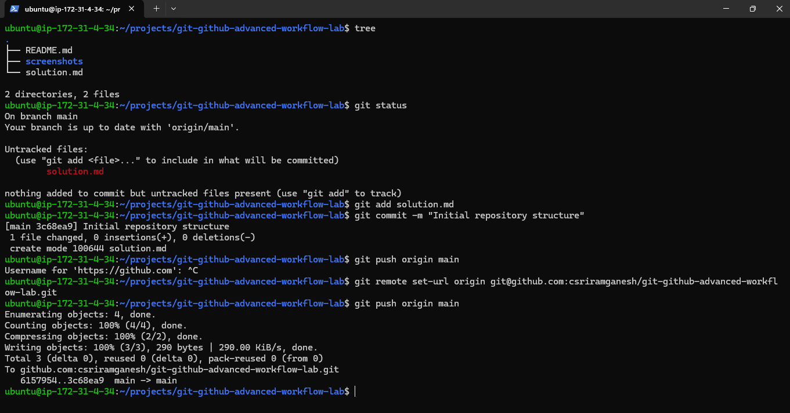

## Feature Branch Created and Pushed

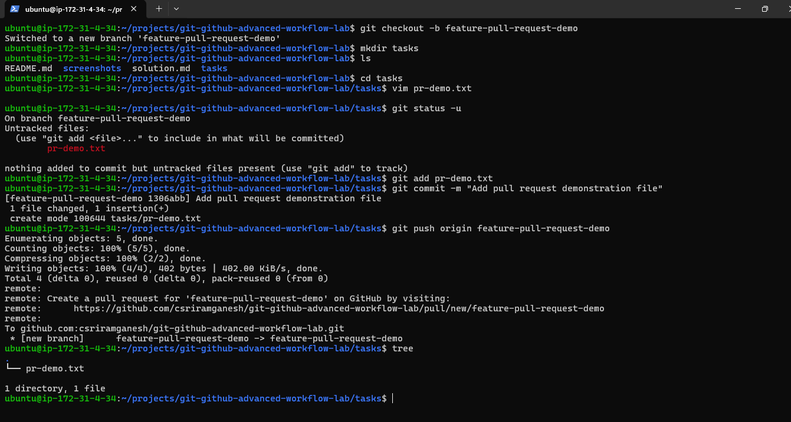

## Compare Pull Request


## Create Pull Request

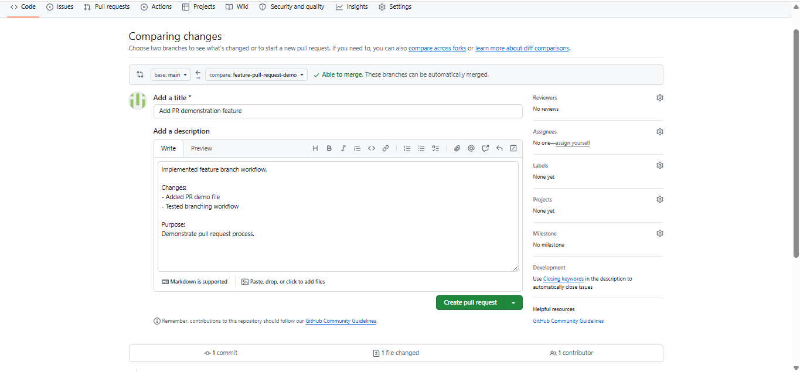

## Pull Request Merged


## Repository After Merge


---

# Task 2: Reset & Revert

## Reset Demo File Created

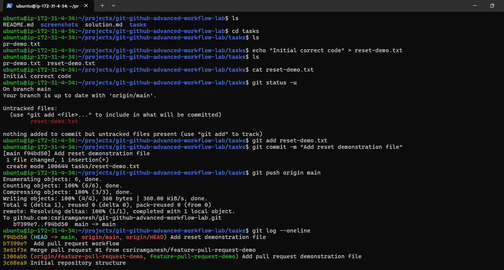

## Bad Commit Created

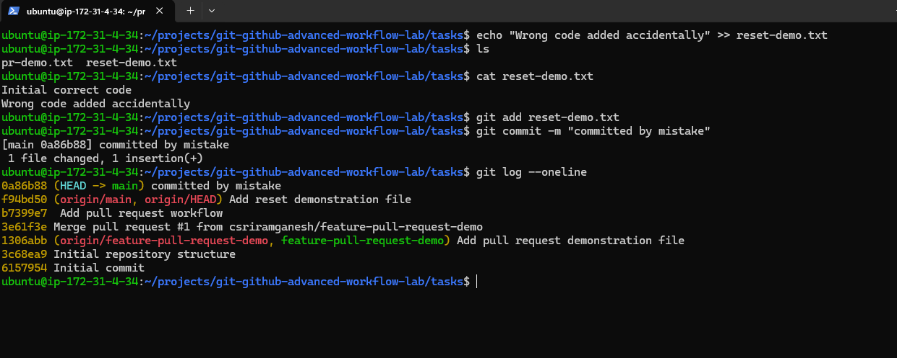

## Soft Reset

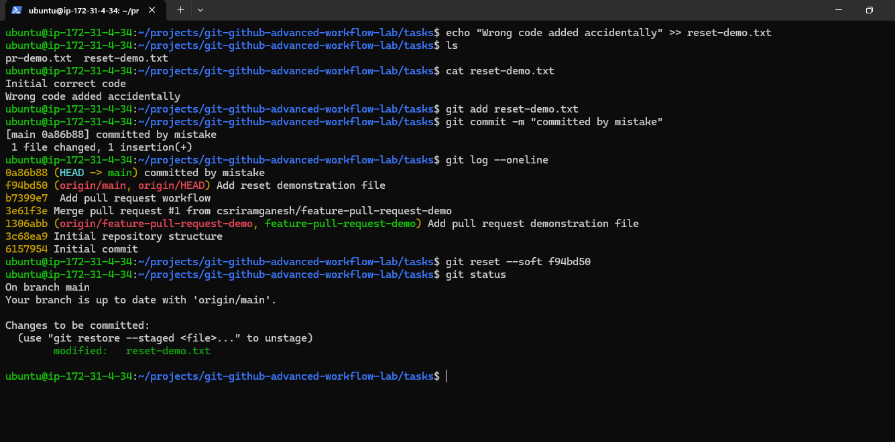

## Mixed Reset

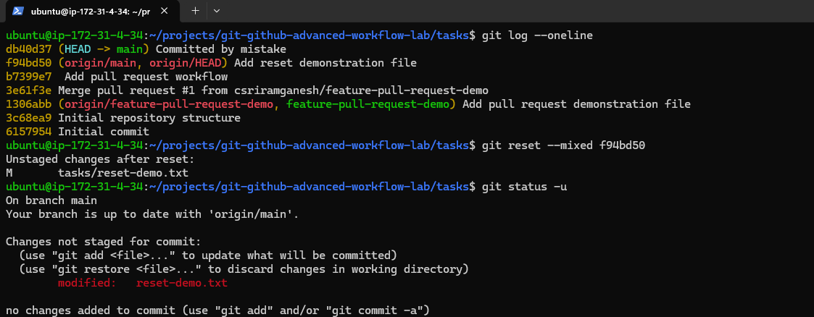

## Hard Reset

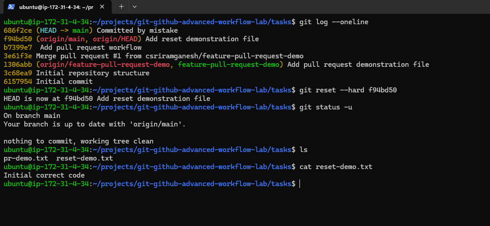

## Git Revert

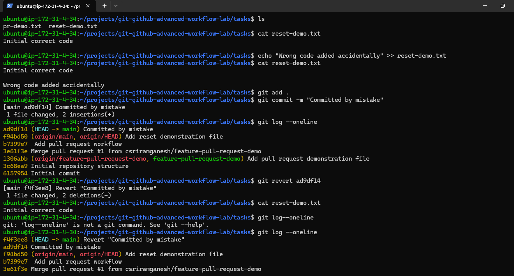

---

# Task 3: Git Stash

## Stash Demo File

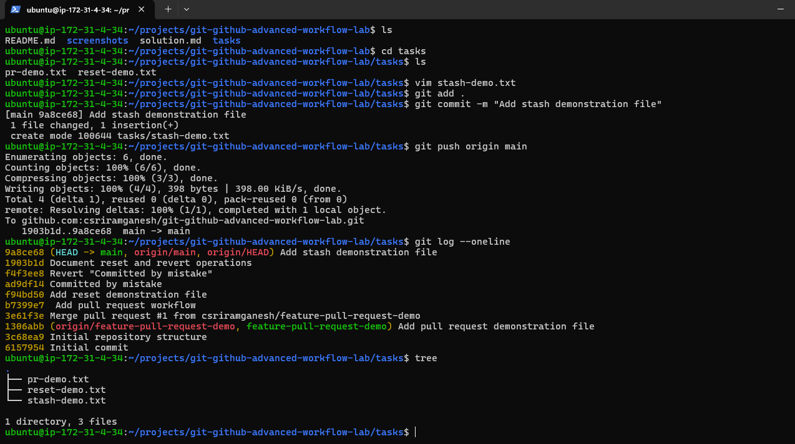

## Uncommitted Changes


## Git Stash


## Hotfix Branch

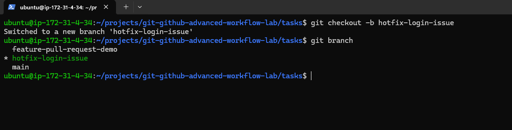

## Stash Pop

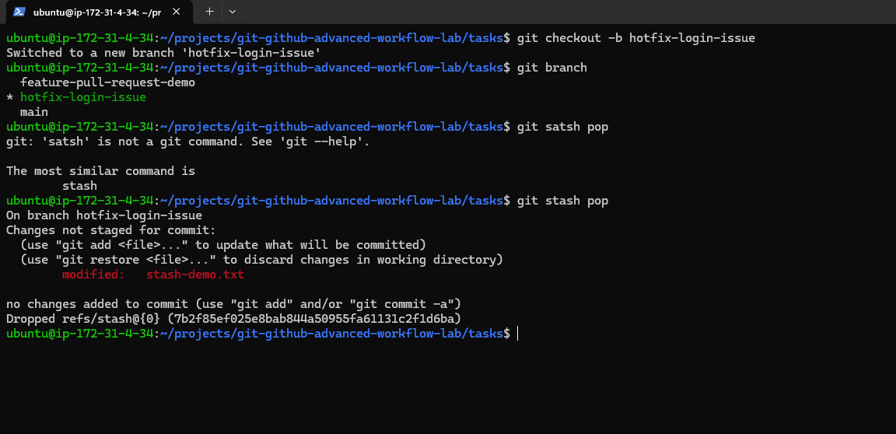

## Stash Apply

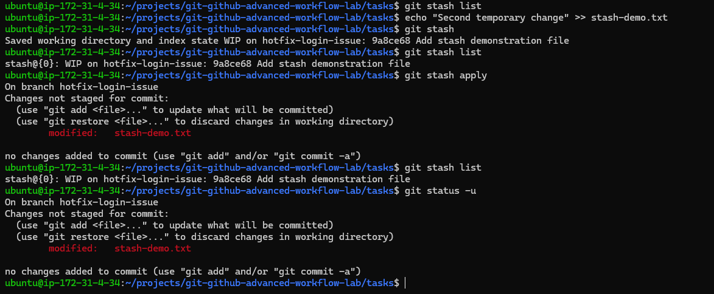

## Stash Cleanup


---

# Task 4: Cherry-Picking

## Cherry-Pick Demo File


## Bug Fix Commit


## Before Cherry-Pick


## Cherry-Pick Applied and Verified


---

# Task 5: Rebasing

## Rebase Demo File


## Feature Branch Before Rebase


## Main Branch New Commit


## Before Rebase History


## Rebase Conflict Resolution


## Rebase Completed

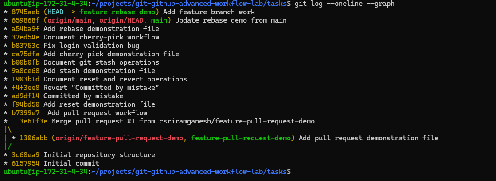

## Rebase File Verified

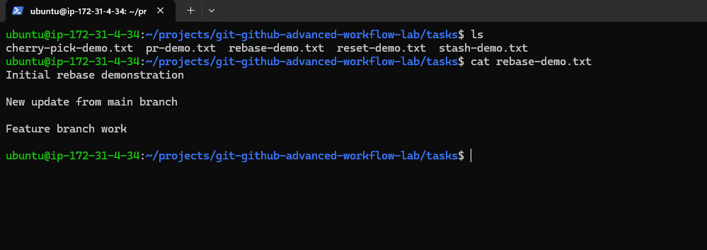

---

# Key Learnings

### Pull Requests

* Collaborate safely using feature branches.
* Review code before merging.
* Maintain structured development workflows.

### Reset & Revert

* Reset rewrites history.
* Revert safely undoes changes while preserving history.

### Git Stash

* Save incomplete work temporarily.
* Switch contexts without creating unnecessary commits.

### Cherry-Picking

* Apply specific commits across branches.
* Useful for bug fixes and hotfixes.

### Rebasing

* Keep commit history clean.
* Avoid unnecessary merge commits.
* Improve project readability.

---

# Commands Practiced

```bash
git checkout -b <branch>

git add .

git commit -m "message"

git push origin <branch>

git reset --soft HEAD~1

git reset --mixed HEAD~1

git reset --hard HEAD~1

git revert HEAD

git stash

git stash pop

git stash apply

git cherry-pick <commit-id>

git rebase main
```

---

# Real-World Applications

* Team Collaboration
* Code Reviews
* Bug Fix Management
* Hotfix Workflows
* CI/CD Development
* DevOps Practices
* Production Issue Resolution

---

# Author

**Sriram Ganesh**

Completed as part of the **90 Days of DevOps** challenge.
